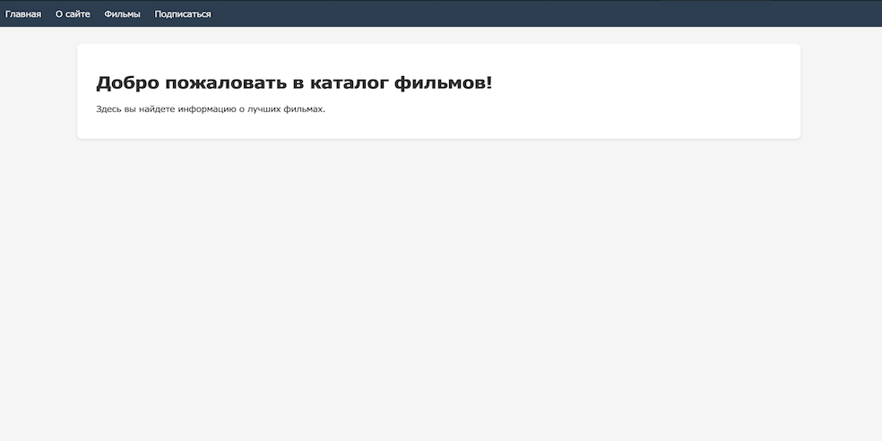
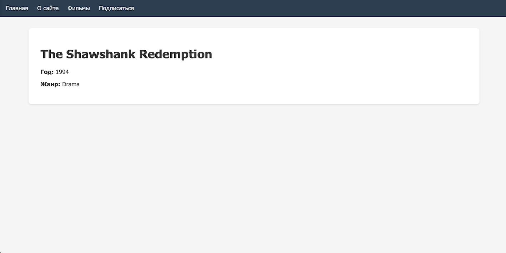
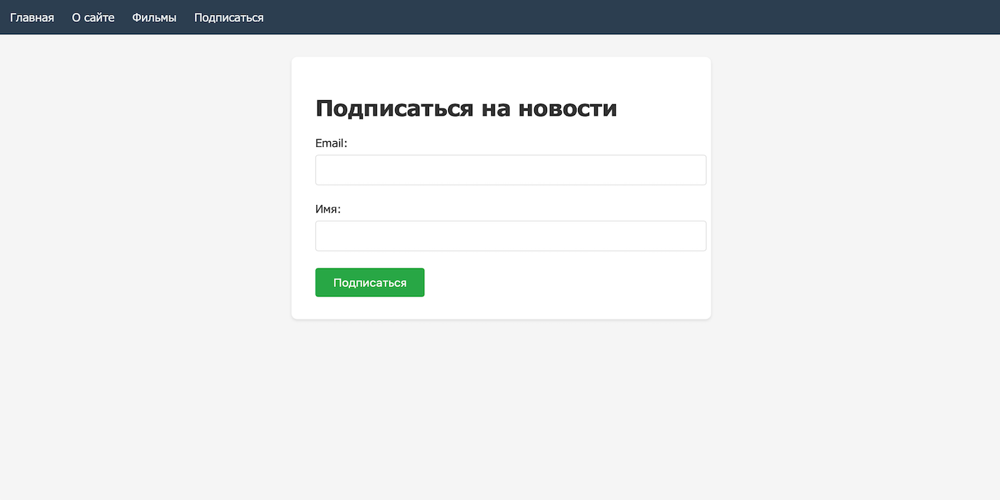

# 🎬 Movie Catalog App


Приложение для каталогизации фильмов с современным интерфейсом и удобной навигацией.

## 📌 Оглавление
- [Особенности](#-особенности)
- [Скриншоты](#-скриншоты)
- [Установка](#-установка)
- [Структура проекта](#-структура-проекта)
- [Доступные команды](#-доступные-команды)
- [Технологии](#-технологии)
- [Лицензия](#-лицензия)

## ✨ Особенности

- Полноценная клиентская маршрутизация
- Фильтрация фильмов по жанрам
- Детальные страницы фильмов
- Адаптивный дизайн
- Оптимизированная загрузка данных
- Форма подписки

## 📸 Скриншоты

| Главная страница | Каталог фильмов |
|-----------------|----------------|
|  |  |

| Детали фильма | Форма подписки |
|--------------|---------------|
|  |  |

## 🛠️ Установка

1. Клонирование репозитория и запуск проекта:
```bash
git clone https://github.com/farid45/Movies.git
cd Movies
npm install
npm start
